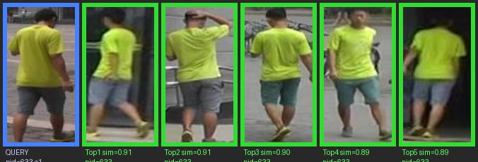
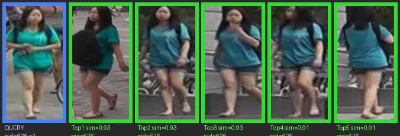
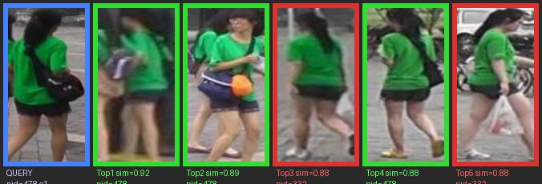
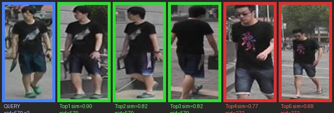
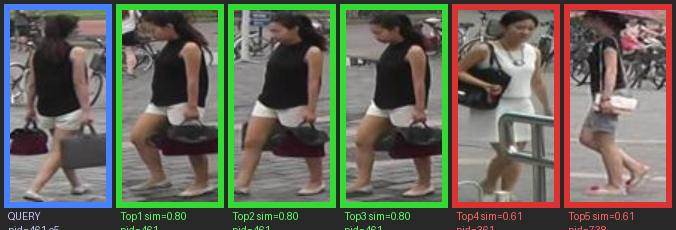
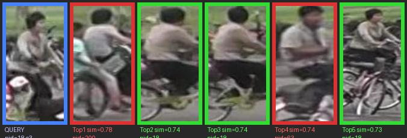

# Demo_Human_Camera_Crossing_Detection


Fine-tuned **CLIP ViT-B/16** for person re-identification across multiple cameras.
Built on [CLIP-ReID](original_CLIP-REID/CLIP-ReID) with the strongest variant: **ViT-CLIP-ReID-SIE-OLP**.

---

## Results on Market-1501

| Model | mAP | Rank-1 | Rank-5 | Rank-10 | mAP+RR | Rank-1+RR | Params | Speed |
|-------|-----|--------|--------|---------|--------|-----------|--------|-------|
| **Baseline** (CLIP-ReID, 60 ep) | 91.5% | 96.4% | 99.1% | 99.5% | 93.6% | 96.7% | 126.8M | 18.8 ms/img |
| **Custom** (ViT-CLIP-ReID-SIE-OLP, S1=3ep S2=60ep) | 93.0% | 97.2% | 99.2% | 99.5% | 85.8% | 97.7% | 127.2M | 21.2 ms/img |

> RR = k-reciprocal re-ranking.

---

## Retrieval Visualisations

Blue border = query. **Green** = correct match. **Red** = incorrect. Similarity scores shown below each result.

### query_005 — pid 633 · All top-5 correct


Distinctive bright yellow-green shirt: all 5 retrievals correct (sim 0.89–0.91) across different camera angles and poses.

---

### query_006 — pid 626 · All top-5 correct


Teal jacket + backpack: perfect top-5 retrieval (sim 0.91–0.93) including viewpoint changes.

---

### query_001 — pid 478 · Rank-1 correct (3/5)


Green shirt + dark shorts. Rank-1 and Rank-2 correct (sim 0.89–0.92). Two false positives at sim 0.88 — a different person with near-identical clothing, illustrating the hard-negative failure mode.

---

### query_003 — pid 570 · Rank-1 correct (3/5)


Black graphic T-shirt + dark shorts + green shoes. Top-3 correct (sim 0.82–0.90). Rank-4/5 false positives share the same outfit, sim drops to 0.69–0.77.

---

### query_019 — pid 461 · Rank-1 correct (3/5)


Dark top + white skirt + handbag. Top-3 correct (sim 0.80). Rank-4/5 false positives at sim 0.61 — large similarity gap separates true matches from false ones.

---

### query_002 — pid 18 · Rank-1 incorrect (4/5)


Back-view bicycle rider. Top-1 wrong (sim 0.78, different person on bicycle). Rank-2 through Rank-5 correct (sim 0.73–0.74). Failure driven by viewpoint ambiguity and lack of distinguishing front-facing features.

---

## Model Architecture

Two-stage fine-tuning of CLIP ViT-B/16:

```
Input (224×224)
    ↓
ViT-B/16  [12 layers · 12 heads · 768-d]
    ├─ CLS token → visual_proj (768→512) → L2-norm      [global feat]
    └─ 196 patch tokens
    ↓
SIELayer   adds cam_embedding(cam_id) + view_embedding(view_id)
    ↓
OLPHead    top-16 patches by L2-norm → max-pool → Linear(1024→512) → L2-norm
    ↓
BN(512) → Linear(512 → num_pids)                        [classifier, train only]
```

| Component | Role |
|-----------|------|
| **SIE** | Side Information Embedding — handles camera/viewpoint shift |
| **OLP** | Overlapping Local Patches — occlusion-robust top-k patch fusion |
| **PromptLearner** | Per-identity learnable CLIP text tokens (Stage 1 only) |

### Training Protocol

| | Stage 1 | Stage 2 |
|-|---------|---------|
| **Trainable** | PromptLearner only | Image encoder + SIE + OLP + BN + classifier |
| **Frozen** | All CLIP weights | Text encoder |
| **Loss** | Bidirectional SupConLoss (I→T + T→I) | 0.25 × ID + 1.0 × Triplet + 1.0 × I2T |
| **Purpose** | Learn per-identity text anchors | Align image features to text space |

---

## Directory Structure

```
src/
├── config/      PedestrianReIDConfig — all hyperparameters
├── datasets/    Market1501, transforms, RandomIdentitySampler
├── models/      CLIPReIDPedestrianModel, PromptLearner, SIELayer, OLPHead
├── losses/      TripletLoss, IDLoss, SupConLoss
├── train/       train_stage1.py, train_stage2.py
├── reid/        ReIDPipeline, CLIPEncoder, CosineMatcher, TemporalFeatureBank
└── eval/        evaluate.py, reranking.py, model_health_check.py

scripts/
├── baseline_eval.py    Evaluate baseline + custom side-by-side
├── run_experiment.py   Full comparison → dated markdown report
└── mot_inference.py    Multi-camera MOT inference

model/
├── model_baseline/     Official CLIP-ReID checkpoint + metrics cache
└── custom/             Fine-tuned stage2_best.pth

docs/
├── viz/retrieval_viz/  Retrieval visualisation images
└── 2026-03-04-experiment-results.md
```

---

## Setup

```bash
# Python 3.13 + CUDA 11.8
python -m venv .venv
source .venv/bin/activate          # Windows: .venv\Scripts\activate
pip install -r requirements.txt
```

---

## Evaluate

```bash
# Baseline + custom side-by-side comparison table
python scripts/baseline_eval.py \
    --market1501-root /path/to/Market-1501-v15.09.15

# Full dated markdown report
python scripts/run_experiment.py \
    --market1501-root /path/to/Market-1501-v15.09.15 \
    --skip-baseline                # reuse cached baseline JSON
```

---

## Train

```bash
# Stage 1 — PromptLearner (recommend ≥30 epochs)
python -m src.train.train_stage1

# Stage 2 — image encoder fine-tuning
python -m src.train.train_stage2

# Smoke test (3+2 epochs, 100 IDs, CPU-safe)
python -m src.train.train_stage1 --mini
python -m src.train.train_stage2 --mini
```

Key config fields (`src/config/defaults.py`):

| Field | Default | Note |
|-------|---------|------|
| `epochs_stage1` | 120 | Reduce to 30 for a faster re-train |
| `epochs_stage2` | 60 | |
| `match_threshold` | 0.7 | CosineMatcher min similarity |
| `olp_k` | 16 | Top-k patches for OLP fusion |
| `rerank_k1 / k2` | 20 / 6 | k-reciprocal reranking |

---

## Citation

Built on [CLIP-ReID](https://github.com/Syliz517/CLIP-ReID) (Li et al., 2023).
